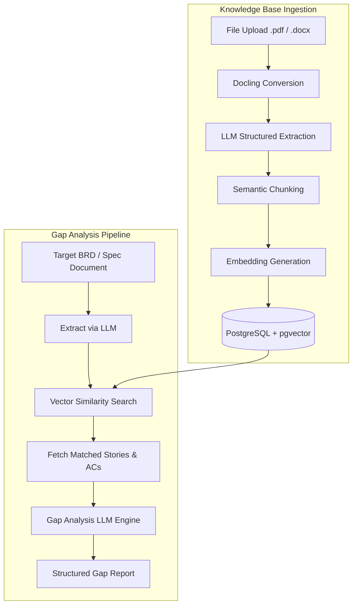

# BRD & UserStory Gap Analyzer

An advanced, automated Retrieval-Augmented Generation (RAG) pipeline and full-stack application designed to evaluate document disparities, analyze requirements coverage, and detect structural functional gaps between Business Requirement Documents (BRDs), User Stories, and Acceptance Criteria (AC).

Natively ingesting unstandardized client documentation (PDFs, Word `.docx`, Markdown), the platform leverages **Docling** for document parsing, **OpenAI (GPT-4o)** for structured requirement extraction and gap evaluation, and **PostgreSQL with `pgvector`** for semantic vector similarity retrieval.

---

## 🎯 Key Features

- **Automated Document Ingestion**: Converts complex PDFs and `.docx` files into clean markdown structures using Docling.
- **Structured Requirement Extraction**: Employs LLMs to logically parse unstandardized documents into granular User Stories and Acceptance Criteria (AC).
- **RAG-Powered Gap Analysis**: Contextually compares target project documents against an existing vector database to identify missing, partial, or contradictory requirements.
- **Conversational KB Chat**: Interactive chat interface over ingested knowledge base documents with source document citation links.
- **Role-Based Authentication**: Secure session-based auth supporting `admin` and `user` access levels.
- **Full-Stack Application**: Modern web UI built with React/Vite and backend powered by FastAPI & PostgreSQL `pgvector`.

---

## 🏗️ Architecture Overview

The pipeline operates across two primary workflows: **Knowledge Base Ingestion** and **Gap Analysis Execution**.



### 🧩 Core System Components

| Component | Location | Description |
|---|---|---|
| **FastAPI Backend** | `src/rag_api/app.py` | REST API service exposing authentication, KB management, and gap analysis endpoints. |
| **Pipeline Orchestrator** | `src/rag_ingest/pipeline.py` | Manages the end-to-end ingestion, parsing, chunking, and embedding creation workflow. |
| **Document Ingestor** | `src/rag_ingest/ingest.py` | Interfaces with `Docling` to extract clean structured markdown from PDFs and Office docs. |
| **LLM Extractor** | `src/rag_ingest/extractor.py` | Prompts GPT-4o to parse documents into validated JSON schemas for Stories and Criteria. |
| **Vector Store** | `src/rag_ingest/store.py` | Manages vector indexing, similarity queries, and CRUD operations on `pgvector`. |
| **React Frontend** | `frontend/` | Vite + React web client providing dashboard views, upload flows, gap analysis metrics, and KB chat. |

---

## 🔬 RAG Pipeline Details

1. **Document Conversion**: Uploaded files (`.pdf`, `.docx`) are parsed via IBM's **Docling** library to preserve table structures and structural headers.
2. **Entity & Feature Extraction**: GPT-4o extracts distinct functional User Stories along with their corresponding Acceptance Criteria (`story_id`, `criteria`).
3. **Semantic Vector Store**:
   - Each story and acceptance criteria chunk is embedded using OpenAI's `text-embedding-3-small` (or `text-embedding-ada-002`) into 1536-dimensional vectors.
   - Embeddings are stored in PostgreSQL using the `pgvector` extension with metadata (source path, chunk type, page numbers).
4. **Contextual Vector Retrieval**: Target requirement documents are embedded and matched against existing database vectors using cosine distance similarity.
5. **LLM Gap Verdict**: The matching user stories and criteria are fed alongside the target requirements into an analysis prompt. The engine generates structured gap classifications (`fully_covered`, `partially_covered`, `missing`, `conflicting`) with actionable recommendation notes.

---

## 🛠️ Quick Start & Usage Instructions

### Prerequisites
- Docker & Docker Compose
- Python 3.10+ (for local non-docker execution)
- OpenAI API Key

### 🚀 Running via Docker Compose (Recommended)

1. **Clone the repository:**
   ```bash
   git clone https://github.com/metharunvenkat-ctrl/BRD-UserStory-Gap-Analyzer.git
   cd BRD-UserStory-Gap-Analyzer
   ```

2. **Configure Environment Variables:**
   ```bash
   cp .env.example .env
   ```
   Edit `.env` and insert your `OPENAI_API_KEY`:
   ```env
   OPENAI_API_KEY=your_openai_api_key_here
   ```

3. **Spin up containers:**
   ```bash
   make up
   # or using docker compose directly:
   docker compose up -d --build
   ```

4. **Access Applications:**
   - **Frontend UI**: `http://localhost:5173`
   - **FastAPI Docs**: `http://localhost:8000/docs`

5. **Default Credentials**:
   - **Admin**: `admin1` / `admin1pass`
   - **User**: `user1` / `user1pass`

---

## 📚 Project Structure

```
BRD-UserStory-Gap-Analyzer/
├── data/                      # Sample datasets, knowledge base uploads, metadata
├── docs/                      # Technical documentation (ARCHITECTURE.md, SETUP.md, etc.)
├── frontend/                  # React + Vite web dashboard application
├── manual/                    # Ingestion test scripts & sample docx templates
├── src/
│   ├── config.py              # Application settings & environment variables
│   ├── logging_config.py      # Logger configuration
│   ├── rag_api/               # FastAPI router, models, and auth service
│   └── rag_ingest/            # Docling parser, LLM extractor, chunker, vector store
├── tests/                     # Unit and integration test suite
├── .dockerignore
├── .env.example
├── .gitattributes             # Forces GitHub Linguist classification for Python
├── .gitignore
├── Dockerfile
├── docker-compose.yml
├── Makefile
├── pyproject.toml
└── requirements.txt
```

---

## 👥 Contributors & Credits

- [metharunvenkat-ctrl](https://github.com/metharunvenkat-ctrl)
- Claude
